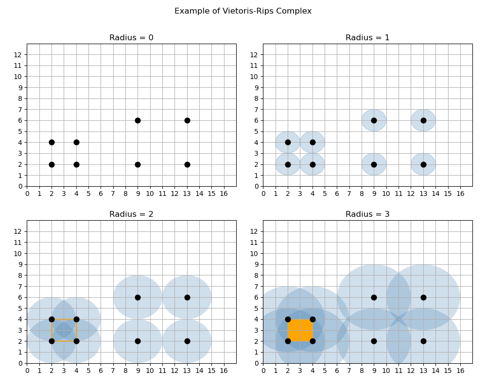
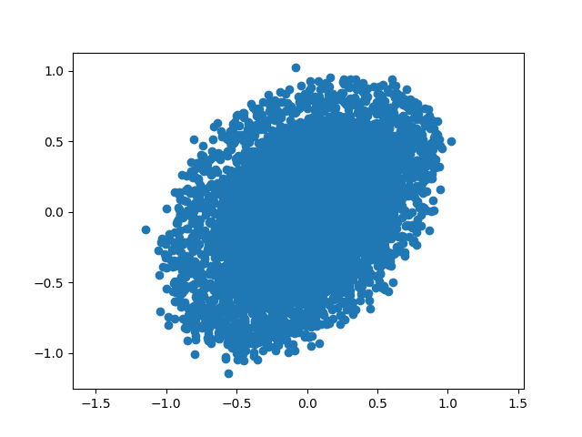
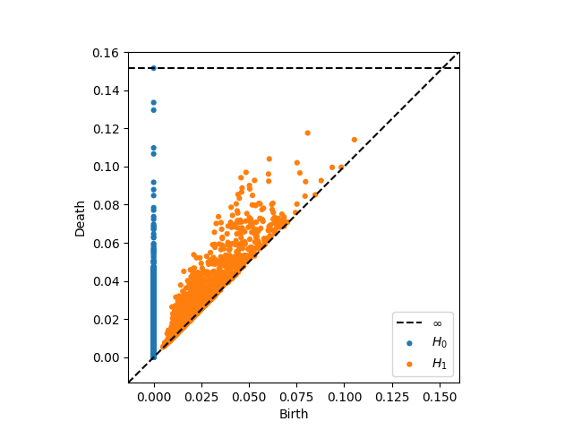

# Musiplexity: Classifying Music by Genre Using Data Analysis and Machine Learning

This is project I conducted as part of an unpaid internship with the Patriot Machine Learning Research Group at Francis Marion University. This research analyzes how well machines can sort musical selections into predetermined genres using persistent homology and k-means clustering.

## Inspiration

When I was completing my undergraduate degree in Computer Science, I wanted an opportunity to explore interest areas outside of pure software engineering. Having a musical background from high school, I wanted to learn more about audio signal analysis and how it can be incorporated with artifical intelligence. The university had just recently conducted an artifical intelligence course, so I decided to discuss the project with the lecturer, Dr. Ivan Dungan. After workshopping the project and scaling back the intensity, we landed on our research question: Can a computer sort musical selections into predetermined genres with little to no human interaction?

## Background

Though the two main topics for this research were signal analysis and artifical intelligence, this work also introduced me to more intricate concepts of data science. For this project, we utilized topological data science, using simple complexes from topology to describe large structure sets. Within topological data science is a method named persistent homology that studies features within graphical planes. Speficially, this targets persistent features at different spatial scales to separate important aspects from noise.

To study these identities, I utilized the Viteoris-Rips complex, a method that analyzes these features as "holes." Given a set of points, we can form a simplex (a simple n-dimensional shape) by defining a distance from each of these points and creating a relationship with all other points that fall within this diameter.

Below is a simple example of the Viteoris-Rips complex. Here we have two sets of points that form squares with different spatial dimensions. When our distance or radius is zero, there are no relationships between the points. However, as we increase the radius, we begin to see the simplex form. With a distance of two radii, line segments or edges are formed within the set of points that form the smaller dimensional square, whereas the set of points that form the larger dimensional square still have no perceived relationship. With a radii of three, the smaller dimensional square is fully formed and what was now once a "hole" is fully realized as a simplex.

## Methodology

The initial method was to take an audio signal, convert it into a time series, and filter the signal using a Butterworth low-pass filter to reduce the number of frequencies and leave a smooth, low-frequency signal for analysis. Our hypothesis was that if we isolated the lower frequencies, we would obtain the most important features that could be used to identify the genre. These filtered samples are then processed through a window function to produce different views of the dataset and predict future trends. Furthermore, this function would define the point cloud that would be processed by our persistence diagram to determine features.

Though it was functional, the output was almost impossible to decipher any unique features from either the point cloud or persistence diagram as seen below. We needed to rethink our methodology and reduce our sample size from the audio signal, while still obtaining the most meaningful pieces of data from the input.

| Dense Point Cloud                                       | Dense Persistence Diagram                    |
| ------------------------------------------------------- | -------------------------------------------- |
|     |  |

Instead of looking at the lowest frequencies, we decided to look at the highest frequencies and take the maximum values within a fixed time interval. This idea surfaced after a brief discussion with musical experts that highlighted how higher frequencies can carry more distinctive characteristics than lower frequencies. To verify this new hypothesis, we implemented this idea with a simple sine curve, taking the maximum-value at every two-second interval. The resulting diagram